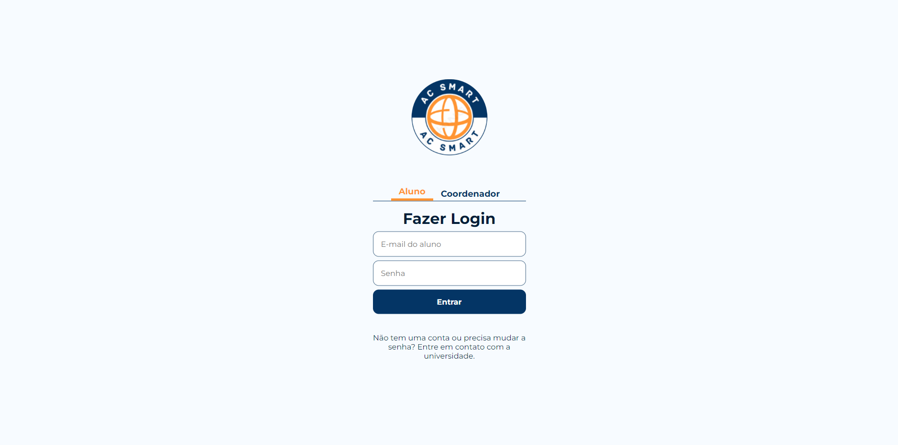
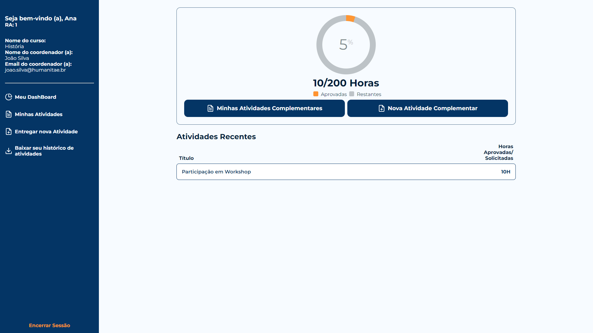
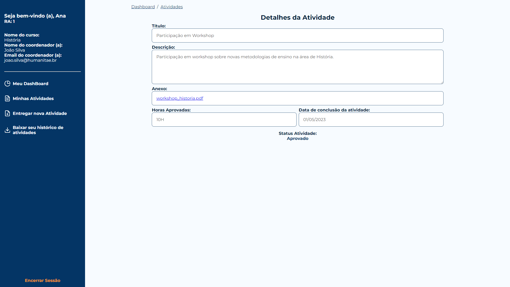

# ac-smart

AC-Smart é uma Aplicação web para entrega de atividades complementares desenvolvida no primeiro semestre de 2024 para o Projeto Integrador da Universidade usando PHP, HTML, CSS, Javascript e MySQL.

Visando facilitar a entrega das atividades que contabilizam horas complementares para conclusão de curso, o AC Smart faz com que essa entrega seja fácil e eficiente, reduzindo o tempo para entrega e correção do coordenador através de uma interface intuitiva e agradável.

### Screenshots


Tela de Login


Dashboard


Detalhes da atividade

# Instalação
### Pré-Requisitos
* xampp: [Link para Download](https://www.apachefriends.org/download.html)
### Instalação
1. Acesse a pasta do Xampp configurada para projetos PHP

2. Clone o repositório
```
git clone https://github.com/gabrielturri/ignite-timer.git
```
3. Importe os arquivos do banco de dados <code>./database/create_database.sql</code> e <code>./database/populate_database.sql</code>